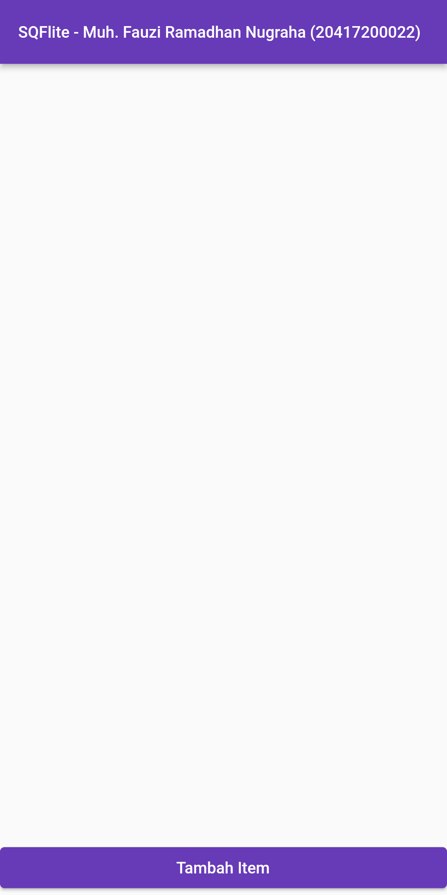

# flutter_sqflite

- Muh. Fauzi Ramadhan Nugraha
- TI - 3B
- 2041720022

Navigation and Route practice for Flutter.
Berikut beberapa hasil praktikum yang berhasil saya kerjakan :

## Hasil Aplikasi

| Home Screen | Klik Tambah Data |
| ------------------ | --------------------------- |
|   |  |

| Klik Tamba Data & Input Garam | Klik Save |
| ------------------ | --------------------------- |
|   |  |

| Klik Tamba Data & Input Gula | Klik Save |
| ------------------ | --------------------------- |
|   |  |

| Klik Tamba Data & Input Terasi | Klik Save |
| ------------------ | --------------------------- |
|   |  |

| Klik Terasi | Edit Terasi | Klik Save |
| ------------------ | --------------------------- | ------------------ |
|   |  |  |

| Klik Hapus | Hasil Hapus |
| ------------------ | --------------------------- |
|   |  |